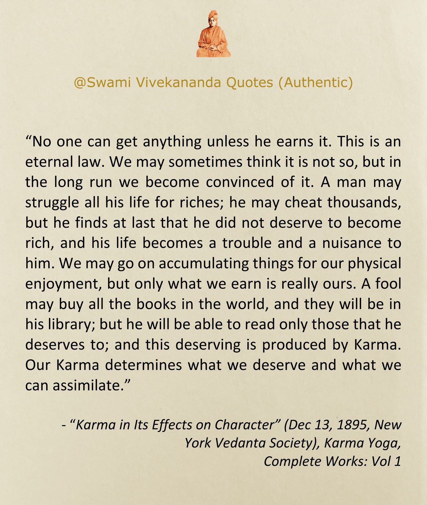
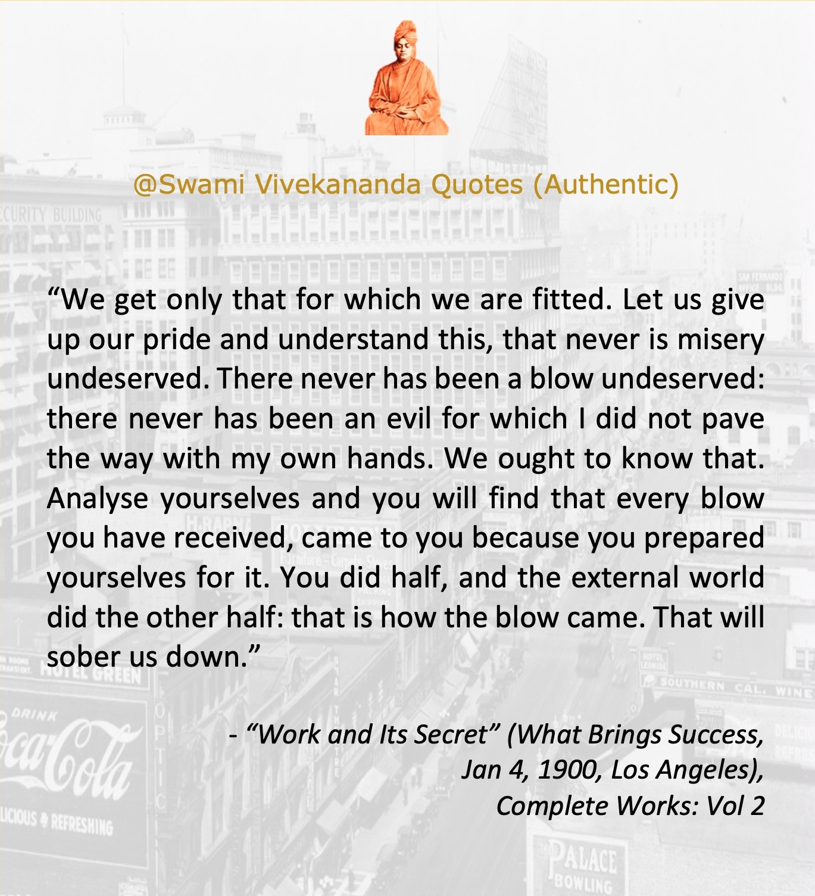
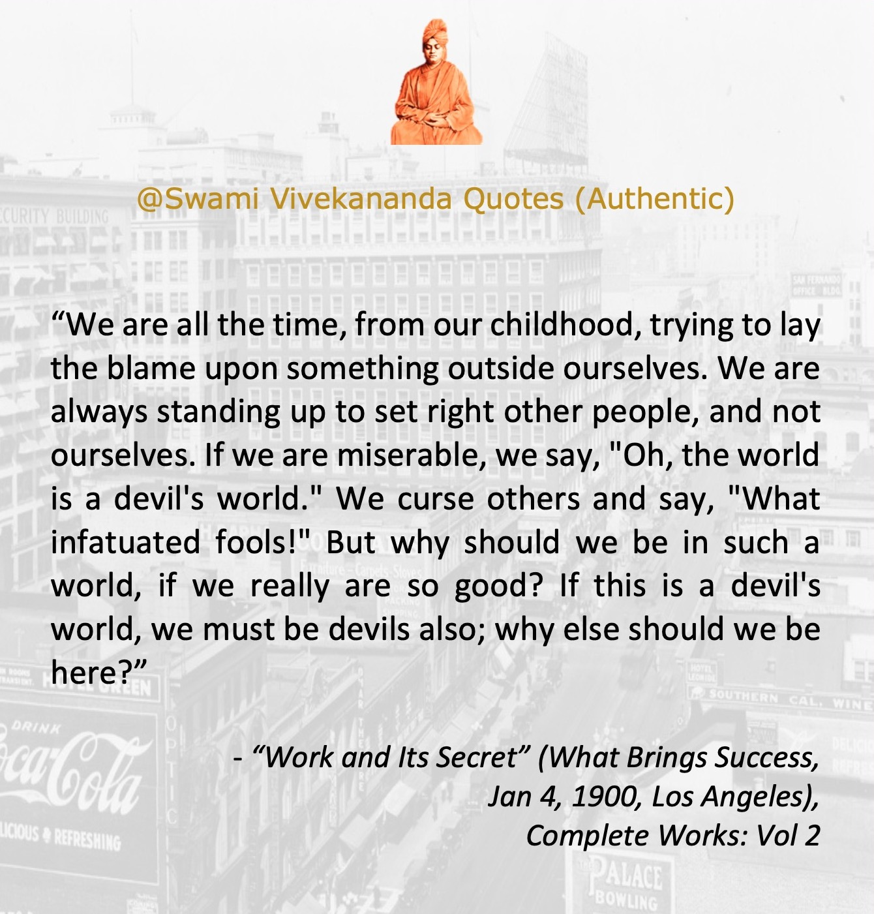
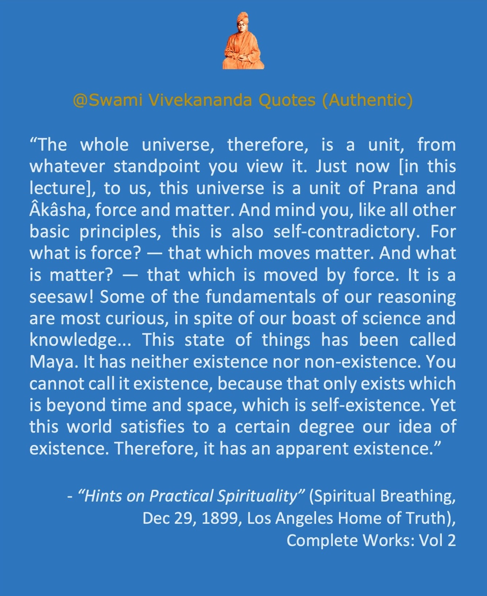

```{r set-options, echo=FALSE, cache=FALSE}
options(width = 150)
```

```{r setup, include = F}
knitr::opts_chunk$set(echo = T)
```

<style type="text/css"> /* This sets the overall width of the HTML page */
.main-container {
  max-width: 1200px;
  margin-left: auto;
  margin-right: auto;
};
p {line-height: 4em;}
</style>


<hr> 

- The purpose of doing this page is to make sure every Vivekananda quote is properly referenced. It is encouraged not to forward any Vivekananda quote in any social media without confirming its reference. Below, all the quotes are authentic Vivekananda quotes. They will be randomly arranged every time you refresh the page. To download an image, right click and then 'save image'. More quotes will be added regularly. For a set of quotes falsely attributed to Vivekananda, see [here](https://onudhyan.blogspot.com/2020/06/quotes-falsely-attributed-to-swami.html){target="_blank"}.

<iframe align="right" src="https://www.facebook.com/plugins/page.php?href=https%3A%2F%2Fwww.facebook.com%2FSwami-Vivekananda-Quotes-Authentic-104968054944575&tabs=timeline&width=240&height=70&small_header=false&adapt_container_width=true&hide_cover=false&show_facepile=true&appId" width="240" height="150" style="border:none;overflow:hidden" scrolling="yes" frameborder="0" allowfullscreen="true" allow="autoplay; clipboard-write; encrypted-media; picture-in-picture; web-share"></iframe>
<br><br><br><br><br><br>

<hr>


<!-- From this page http://www.javascriptkit.com/javatutors/randomorder.shtml -->

```{js, echo=F}
var contents=new Array()
//width is set as 360 because 3 pics in a row makes 1180, and the html page width is set as 1200.
contents[0]=''
contents[1]=''
contents[2]=''
contents[3]=''
contents[4]=''
contents[5]=''
contents[6]=''
contents[7]=''
contents[8]=''
contents[9]=''
contents[10]=''
contents[11]=''
contents[12]=''
contents[13]=''
contents[14]=''
contents[15]=''
contents[16]=''
contents[17]=''
contents[18]=''
contents[19]=''
contents[20]=''
contents[21]=''
contents[22]=''
contents[23]=''
contents[24]=''
contents[25]=''
contents[26]=''
contents[27]=''
contents[28]=''
contents[29]=''
contents[30]=''
contents[31]=''
contents[32]=''
contents[33]=''
contents[34]=''
contents[35]=''
contents[36]=''
contents[37]=''
contents[38]=''
contents[39]=''
contents[40]=''
contents[41]=''
contents[42]=''
contents[43]=''
contents[44]=''
contents[45]=''
contents[46]=''
contents[47]=''
contents[48]=''
contents[49]=''
contents[50]=''
contents[51]=''
contents[52]=''
contents[53]=''
contents[54]=''
contents[55]=''
contents[56]=''
contents[57]=''
contents[58]=''
contents[59]=''
contents[60]=''
contents[61]=''
contents[62]=''
contents[63]=''
contents[64]=''
contents[65]=''
contents[66]=''
```

```{js, echo=F}
var i=0
//variable used to contain controlled random number 
var random
var spacing="<br>"
//while all of array elements haven't been cycled thru
while (i<contents.length){
    //generate random num between 0 and arraylength-1
    random=Math.floor(Math.random()*contents.length)
    //if element hasn't been marked as "selected"
    if (contents[random]!="selected"){
        document.write(contents[random]+'&nbsp;')
        //mark element as selected
        contents[random]="selected"
        i++
    }
}
```


<p>&nbsp;</p> <p>&nbsp;</p> <p>&nbsp;</p>

<hr>


<div align="center">
<a href="https://info.flagcounter.com/Wwks"></a>
</div>

<hr><br>

```{r, eval = F, include = F}
	# Create Rmd html result
	rm(list=ls())
	dir = "/Users/nsanyal/Dropbox/My Passport I/Documents/GitHub/swami-vivekananda-quotes-authentic.github.io"
	setwd(dir)
	library(rmarkdown)
	render( input="index.Rmd" )
```


<!-- 
convert P001.jpeg -resize 20% P001.jpeg
convert P002.jpeg -resize 20% P002.jpeg
convert P003.jpeg -resize 20% P003.jpeg
convert P004.jpeg -resize 20% P004.jpeg

 -->


