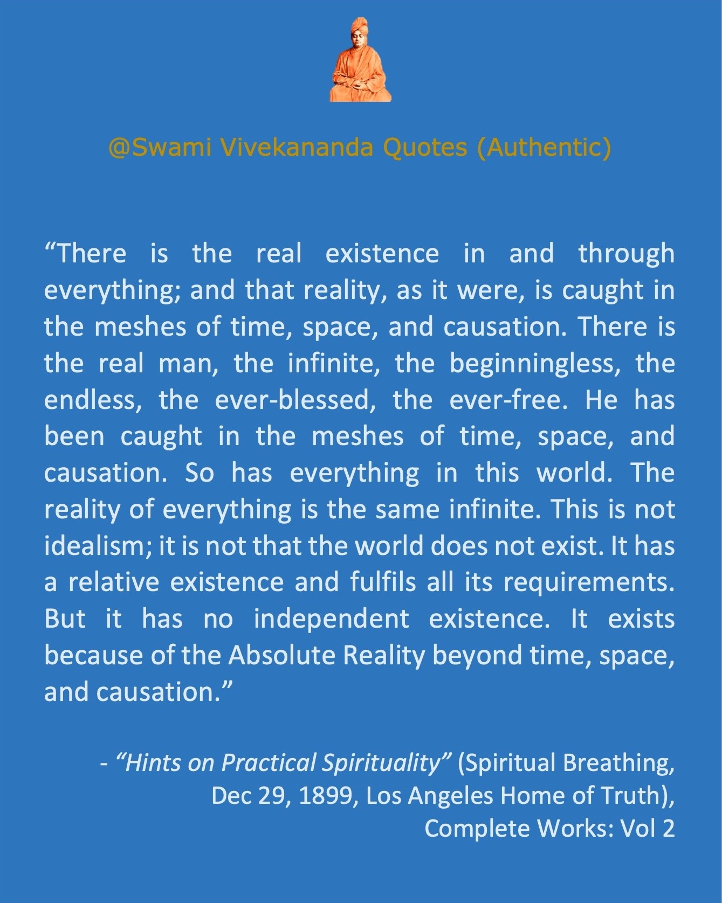

<!-- ### For google site verification. Don't delete this to keep google indexing. ### -->
<head>
<meta name="google-site-verification" content="FGoFsQAYjE2ald5KjM10Ms8FZY1YAtnXKamBSF3aOQY" />
</head>

<style type="text/css"> /* This sets the overall width of the HTML page */
 .main-container {
   max-width: 1200px;
   margin-left: auto;
   margin-right: auto;
 };
 p {line-height: 4em;}
</style>

```{r set-options, echo=FALSE, cache=FALSE}
options(width = 150)
```

```{r setup, include = F}
knitr::opts_chunk$set(echo = T)
```

<!-- ##### JavaScript SDK for enabling Facebook Comments Plugin #### -->
<div id="fb-root"></div>    
<script async defer crossorigin="anonymous" src="https://connect.facebook.net/en_US/sdk.js#xfbml=1&version=v9.0" nonce="aBTZOgEr">
</script>
<!-- ################ -->

<hr> 

<!-- ################ Introduction text ################-->
- The purpose of doing this page is to make sure every Vivekananda quote is properly referenced. It is encouraged not to forward any Vivekananda quote in any social media without confirming its reference. Below, all the quotes are authentic Vivekananda quotes. They will be randomly arranged every time you refresh the page. To download an image, right click and then 'save image'. More quotes will be added regularly. For a set of quotes falsely attributed to Vivekananda, see [here](https://onudhyan.blogspot.com/2020/06/quotes-falsely-attributed-to-swami.html){target="\_blank"}.
<!-- ################ -->


<!-- ################ Facebook frame ################ -->
<iframe align="right" src="https://www.facebook.com/plugins/page.php?href=https%3A%2F%2Fwww.facebook.com%2FSwami-Vivekananda-Quotes-Authentic-104968054944575&tabs=timeline&width=240&height=70&small_header=false&adapt_container_width=true&hide_cover=false&show_facepile=true&appId" width="240" height="150" style="border:none;overflow:hidden" scrolling="yes" frameborder="0" allowfullscreen="true" allow="autoplay; clipboard-write; encrypted-media; picture-in-picture; web-share"></iframe>
<br><br><br><br><br><br>
<!-- ################ -->

<hr>


<!-- ################ Javascript to randomly organize pics ################ --> 
<!-- http://www.javascriptkit.com/javatutors/randomorder.shtml -->
```{js, echo=F}
 var contents=new Array()
 //width is set as 360 because 3 pics in a row makes 1180, and the html page width is set as 1200.
 contents[0]=''
 contents[1]=''
 contents[2]=''
 contents[3]=''
 contents[4]=''
 contents[5]=''
 contents[6]=''
 contents[7]=''
 contents[8]=''
 contents[9]=''
 contents[10]=''
 contents[11]=''
 contents[12]=''
 contents[13]=''
 contents[14]=''
 contents[15]=''
 contents[16]=''
 contents[17]=''
 contents[18]=''
 contents[19]=''
 contents[20]=''
 contents[21]=''
 contents[22]=''
 contents[23]=''
 contents[24]=''
 contents[25]=''
 contents[26]=''
 contents[27]=''
 contents[28]=''
 contents[29]=''
 contents[30]=''
 contents[31]=''
 contents[32]=''
 contents[33]=''
 contents[34]=''
 contents[35]=''
 contents[36]=''
 contents[37]=''
 contents[38]=''
 contents[39]=''
 contents[40]=''
 contents[41]=''
 contents[42]=''
 contents[43]=''
 contents[44]=''
 contents[45]=''
 contents[46]=''
 contents[47]=''
 contents[48]=''
 contents[49]=''
 contents[50]=''
 contents[51]=''
 contents[52]=''
 contents[53]=''
 contents[54]=''
 contents[55]=''
 contents[56]=''
 contents[57]=''
 contents[58]=''
 contents[59]=''
 contents[60]=''
 contents[61]=''
 contents[62]=''
 contents[63]=''
 contents[64]=''
 contents[65]=''
 contents[66]=''
 contents[67]=''
 contents[68]=''
 contents[69]=''
 contents[70]=''
 contents[71]=''
 contents[72]=''
 contents[73]=''
 contents[74]=''
 contents[75]=''
``` 
<script>
 var i=0
 //variable used to contain controlled random number 
 var random
 var spacing="<br>"
 //while all of array elements haven't been cycled thru
 while (i<contents.length){
     //generate random num between 0 and arraylength-1
     random=Math.floor(Math.random()*contents.length)
     //if element hasn't been marked as "selected"
     if (contents[random]!="selected"){
         document.write(contents[random]+'&nbsp;')
         //mark element as selected
         contents[random]="selected"
         i++
     }
 }
</script>
<!-- ################ -->


<!-- ################ Javascript to pop-up image on click ################ --> 
<!-- https://www.w3schools.com/howto/howto_css_modal_images.asp -->
<!-- The Modal -->
<div id="myModal" class="modal">
  <span class="close">&times;</span>  <!-- The Close Button -->
    <!-- Modal Content (The Image) -->
  <div id="caption"></div>  <!-- Modal Caption (Image Text) -->
</div>

<script>
 // Get the modal
 var modal = document.getElementById("myModal"); 

 // Get the image and insert it inside the modal - use its "alt" text as a caption
 var images = document.getElementsByClassName('myImages');
 var modalImg = document.getElementById("img01");
 var captionText = document.getElementById("caption");
 for (var i = 0; i < images.length; i++) {
  var img = images[i];
  img.onclick = function(){
    modal.style.display = "block";
    modalImg.src = this.src;
    captionText.innerHTML = this.alt;
  }
 } 

 // Get the <span> element that closes the modal
 var span = document.getElementsByClassName("close")[0]; 

 // When the user clicks on <span> (x), close the modal
 span.onclick = function() { 
   modal.style.display = "none";
 }
</script>
<!-- ################ -->

<br>
<a target="_blank" OnClick="window.open(this.href,'targetWindow','toolbar=no,location=0,status=no,menubar=no,scrollbars=yes,resizable=yes,width=600,height=300'); return false;" href="https://www.facebook.com/sharer/sharer.php?u=https://swami-vivekananda-quotes-authentic.github.io/P075.jpeg">
  
</a>


<!-- ####### Facebook and pinterest share buttons at topleft of every image ######-->

<script>
var a2a_config = a2a_config || {};
a2a_config.overlays = a2a_config.overlays || [];
a2a_config.overlays.push({});
</script>

<script async src="https://static.addtoany.com/menu/page.js"></script>


<p>&nbsp;</p> <p>&nbsp;</p> <p>&nbsp;</p>
<hr>

<!-- ################ Visit counter ############## -->

<div align="center">
<a href="https://info.flagcounter.com/Wwks"></a>
</div>

<hr><br>

<!-- ################ Facebook comments plugin ############## -->

<div class="fb-comments" data-href="https://swami-vivekananda-quotes-authentic.github.io" data-width="1000" data-numposts="10"></div>

<br><br><br>


```{r, eval = F, include = F}
	# Create Rmd html result
	rm(list=ls())
	dir = "/Users/nsanyal/Dropbox/My Passport I/Documents/GitHub/swami-vivekananda-quotes-authentic.github.io"
	setwd(dir)
	library(rmarkdown)
	render( input="index.Rmd" )
```


